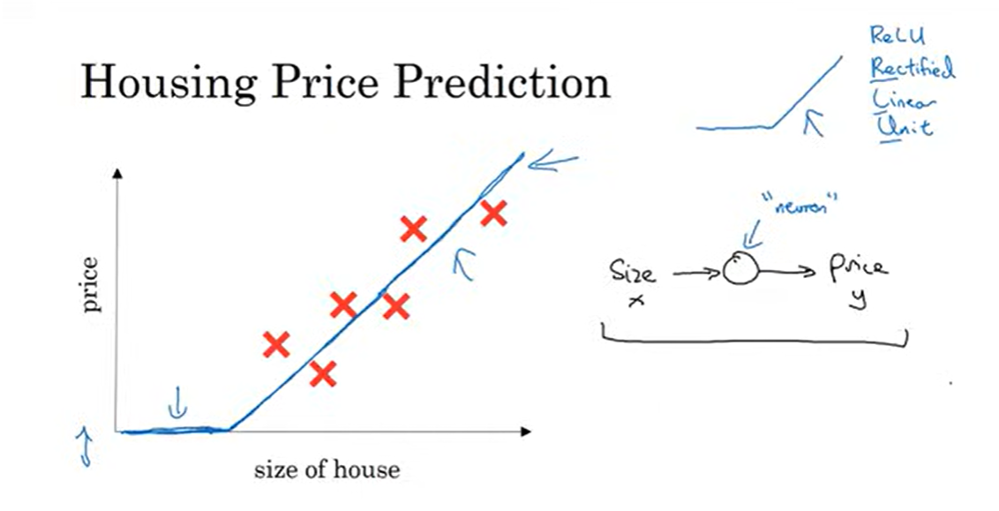
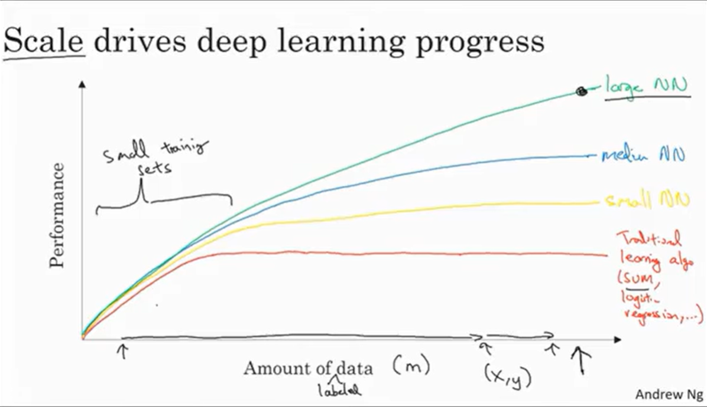

# Deep Learning (Basics to Advanced)

> *Deep Learning is basically the study of Neural Networks.*

## What are Neural Networks?
> A **Neural Network** is made up of fundamental building blocks called neurons.
>
> A **neuron** is connected to one or many inputs and a **single** output.

Let us understand the necessity and and basic functioning of a Neural Network via an example mentioned in the video: 

In the example, we need to predict the house price, from the given house sizes in sq ft.

So, we draft the price of the houses (y) as a function of their size (x) as shown in the pic:
>

 >Now we could use the Linear regression and directly show the linear variation, but as we can see the straight line extends below the x-axis to become negative. *But house prizes (y) can never be negative...*

So we shall mould our **function** by using a single neural network consisting of a single neuron with a single input (size) and a single output (price). This function will be our activation function and specifically for our example we shall be using the **ReLU (Rectified Linear Unit)** function. 
One of the properties of this function is that it eliminates negative output values and initializes them to 0. But this is very basic info about ReLU further detail is to be studied as we dive deeper.

> Now if we actually think about it .. there cant be just one factor affecting house prices, so after considering some possible factors we get a bigger neural network with each hidden unit having multiple inputs (features)[x1, x2, x3, x4] and the ultimate ones having a single output (price)[y].

>This neural network will itself study the relationship between x and y and figure out the functions acting from x to y.

### Supervised Learning: Description and Applications
> In Supervised Learning the input feature (x) and the output feature (y) are already known and the neural network has to study the relationships b/w inputs and output (training) and then test the patterns which it has learnt.
>
>> It can learn patterns for both Structured and Unstructured data. Structured data has specific columns as the inputs and outputs for learning whereas Unstructured data is in the form of audio, image,plain text,etc.
>
## How does scale drive Deep Learning progress?

> The image shown above is not your regular input and output y=f(x) function. It indicates how nicely your neural network performs on small v/s large training datasets. 
>
>>From the graph we can observe, that all neural networks as well as traditional regression algos perform the same for small datasets. Whereas for larger datasets (higher value of m), large neural networks tend to perform better than the rest.
>
>This is because large neural networks are more complex and can learn and model tougher non linear relationships as compared to smaller NN's. 