# Week 2 - Logistic Regression as a Neural Network

---

## Binary Classification

Binary classification is used for predicting one of two possible classes.

Output labels:

```
y = 1 -> Positive class (Yes)
y = 0 -> Negative class (No)
```

---

## Training Set Notation

Training example:

```
(x, y)
```

where

```
x -> Input features

y -> Output label
```

For **m** training examples:


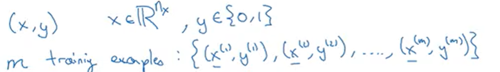


# Image Representation

For an RGB image of size

```
64 × 64 × 3
```

the total number of input features becomes

```
12288
```

Instead of using a matrix, the image is flattened into a single feature vector before being given to the model.This allows machine learning algos to process image data as numerical input.

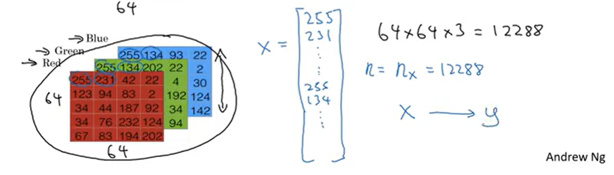
---

# Logistic Regression and Sigmoid Function

Logistic Regression is one of the simplest supervised learning algorithms used for binary classification.

Instead of directly predicting the class, it predicts the **probability** that the input belongs to the positive class.

The model learns two parameters:

```
Weights (w)

Bias (b)
```

These parameters are adjusted during training so that the predicted probability becomes as close as possible to the actual label.

---

The output of the linear equation can take any value from positive to negative infinity
which cannot represent ***probabilities***.

The **Sigmoid Function** converts this value into a probability lying between

```
0 and 1
```

Properties:

- Large positive input -> Output approaches 1
- Large negative input -> Output approaches 0
- Input = 0 -> Output = 0.5

The sigmoid function is smooth and differentiable, making it suitable for gradient descent optimization.

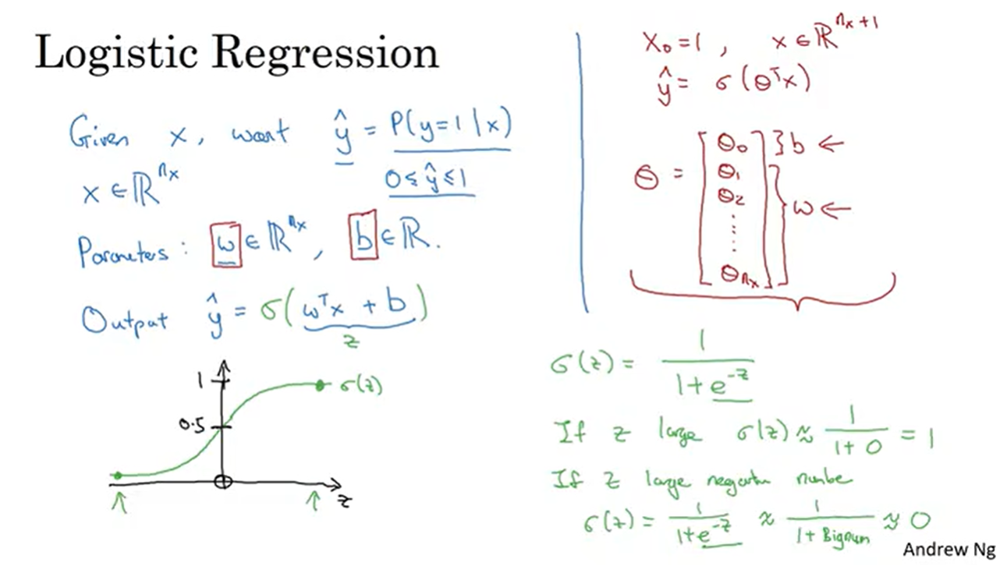

---

# Prediction

The output of logistic regression represents the probability that

```
y = 1
```

A threshold (usually 0.5) is used to convert this probability into the final prediction.

If the probability is greater than or equal to the threshold, the model predicts the positive class; otherwise, it predicts the negative class.
---
---

# Predicted Output (ŷ) vs Actual Output (y)

The model predicts an output called

```
ŷ (y hat)
```

where

```
ŷ → Predicted Output (Probability)

y → Actual Observed Output
```

The goal of Logistic Regression is to make

```
ŷ ≈ y
```

Possible values of the actual output are

```
y = 1 → Positive Class

y = 0 → Negative Class
```

The closer the predicted output is to the actual output, the smaller the error.

---

# Loss Function

The Loss Function measures the error for **one training example (i)**.

It tells us how far the prediction is from the actual output.

Characteristics of this function:

- Smaller loss -> Better prediction
- Larger loss -> Poor prediction

The loss increases significantly when the model is confidently wrong.

This property encourages the model to improve its predictions during training.

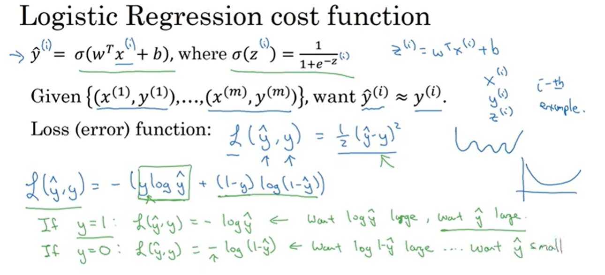

---

# Cost Function

The Cost Function represents the **average loss over the entire training dataset**.

Instead of evaluating one example, it measures how well the model performs on all training examples together.

Training aims to minimize the cost function.

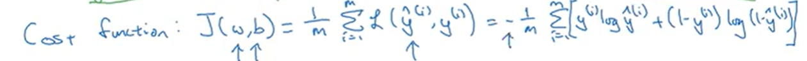

---

# Gradient Descent
---

Gradient Descent is an optimization algorithm used to minimize the **Cost Function**.

Its objective is to find the values of the parameters

```
w -> weight vector

and

b -> bias
```

such that the cost becomes as small as possible.

The algorithm starts with randomly initialized values of **w** and **b**, then repeatedly updates them until the model converges to the minimum cost.

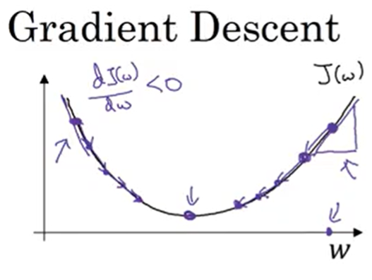

---

## Learning Rate (α)

The learning rate controls the size of each update made during Gradient Descent.

```
α -> Learning Rate
```

- Small α -> Slower convergence but more stable.
- Large α -> Faster learning but may overshoot the minimum and fail to converge.

Choosing an appropriate learning rate is important for efficient training.

---

At every iteration:

1. Compute the gradients of the Cost Function with respect to **w** and **b**.
2. Update both parameters using the Gradient Descent equations.
3. Repeat until the Cost Function no longer decreases significantly.

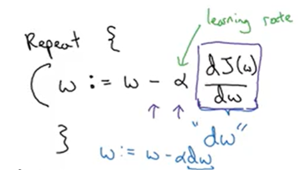

---

## Gradients

A gradient represents the **rate of change** of the Cost Function with respect to a parameter.

For Logistic Regression, we compute:

```
dw -> Gradient of Cost with respect to w

db -> Gradient of Cost with respect to b
```

These gradients indicate the direction in which the parameters should be updated to reduce the cost.

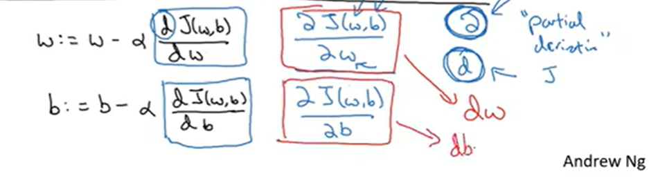

---

- Positive Gradient → Decrease the parameter.
- Negative Gradient → Increase the parameter.
- Zero Gradient → The algorithm has reached (or is very close to) the minimum.

Gradient Descent always updates the parameters in the direction that reduces the Cost Function.

The algorithm is said to have **converged** when the Cost Function stops decreasing significantly between successive iterations.

At convergence:

- The parameters become nearly constant.
- Predictions become more accurate.
- Further updates have minimal effect on the Cost.


---

# Derivatives

Derivatives measure how much a function changes when one of its variables changes slightly.

In Deep Learning, derivatives are used to determine the direction in which model parameters should be updated.

They are used in Gradient Descent for slope calculation and later Backpropagation.

*Already familiar with derivatives so not including any ss or notes about this*

---

---

# Computational Graph

A **Computational Graph** breaks a complex mathematical expression into multiple simple computations.

Instead of evaluating the entire equation in one step, intermediate variables are calculated one by one.

This makes both computation and derivative calculation much simpler.
 
Example mentioned in the vid:

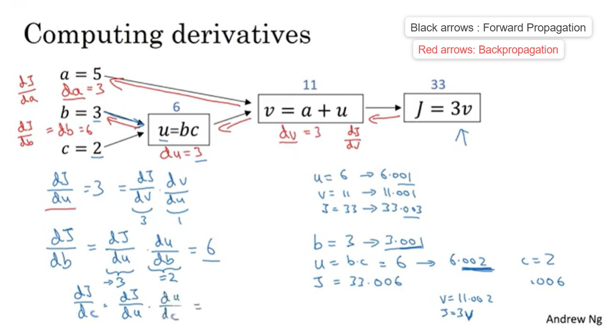

---

As given in the vid, the final output is represented as

```
J = 3(a + bc)
```

Instead of computing it directly, we introduce intermediate variables.

For example,

```
u = bc

v = a + u

J = 3v
```

Now each node performs only one simple operation.

This makes the computation easier to understand and implement.

---

## Forward Propagation

During **Forward Propagation**, we start from the input variables and compute each intermediate value one by one until we obtain the final output **J**.

For the above example:

- We 1st Compute **u**
- Then Compute **v**
- Then Compute **J**

Each intermediate value is stored because it will be required during backpropagation.

---

## Backpropagation

After computing **J**, we move in the reverse direction to calculate derivatives.

Instead of differentiating the entire equation directly, we compute the derivative at each node using the **Chain Rule**.

The derivative of the final output is passed backwards through every intermediate variable until the derivatives of the original inputs are obtained.

This process is called **Backpropagation**.

---

---

## Logistic Regression Gradient Descent

Using Backpropagation and the Chain Rule, we compute the gradients required for Gradient Descent.

The gradients calculated are

```
dz → Gradient of Loss with respect to z

dw → Gradient of Cost with respect to w

db → Gradient of Cost with respect to b
```

These gradients indicate how each parameter affects the Cost Function and are used to update the model parameters during every iteration.
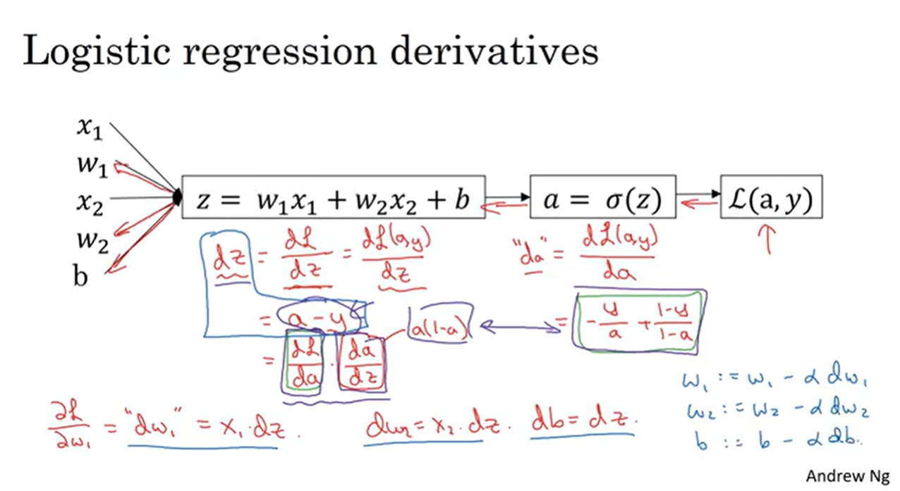

---

# Gradient Descent on m Training Examples

The formulas derived earlier for

```
z

a

Loss

dz

dw

db
```

are applicable to **one training example** only.

To train on the entire dataset, these computations must be performed for all

```
i = 1 to m
```

training examples.

Andrew first explains a **naive implementation using a for loop**, where the algorithm iterates through every training example.

For each iteration:

- Compute Forward Propagation.
- Compute the Loss.
- Compute the gradients

```
dz

dw

db
```

- Accumulate the gradients.

After completing all

```
m
```

iterations, the accumulated gradients are averaged by dividing them by

```
m
```

Finally, the averaged gradients are used to update the parameters

```
w

and

b
```

using Gradient Descent.

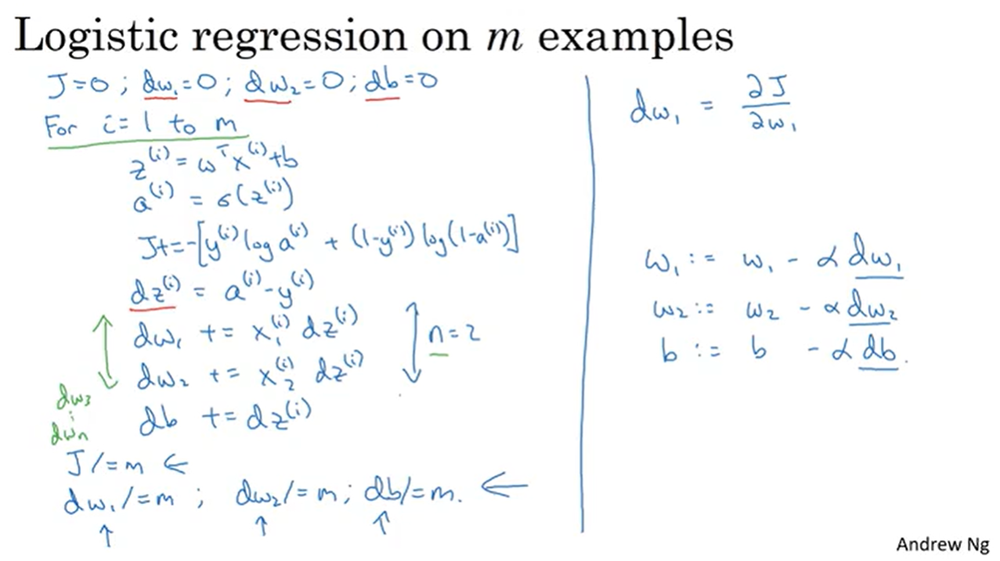

---

Although this implementation is simple, it is computationally inefficient because every training example is processed individually.

This motivates the need for **Vectorization**, where all training examples are processed simultaneously without using explicit for loops.

# Vectorization

Vectorization means the order of getting rid of the excessive for loops in your algo.
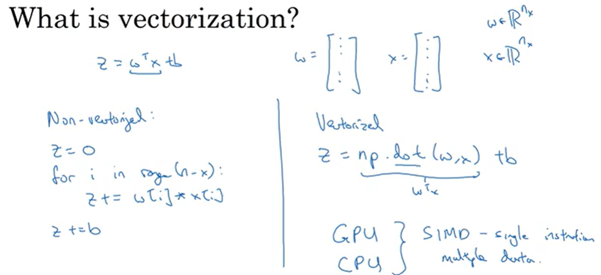
---
Instead of computing the dot product using explicit **for loops**, NumPy allows the entire operation to be performed in a single step.

Here,

```
w → Weight Vector

x → Input Feature Vector
```

Both vectors have the same dimensions.

Using NumPy, the dot product is calculated as:

```python
np.dot(w, x)
```

The `np.dot()` function multiplies the corresponding elements of both vectors and returns the sum of their products.

Instead of manually iterating through every element,

```python
for i in range(n):
    z += w[i] * x[i]
```

a single call to `np.dot()` performs the entire computation much more efficiently.

 NumPy's vectorized operations are used instead of explicit loops because they are faster, cleaner, and optimized for numerical computations.

Advantages: 

- Performs execution almost 500x faster
- Efficient utilization of modern CPUs and GPUs.
- Cleaner and shorter code.
- Essential for training deep learning models on large datasets.

## Hands-on Implementation
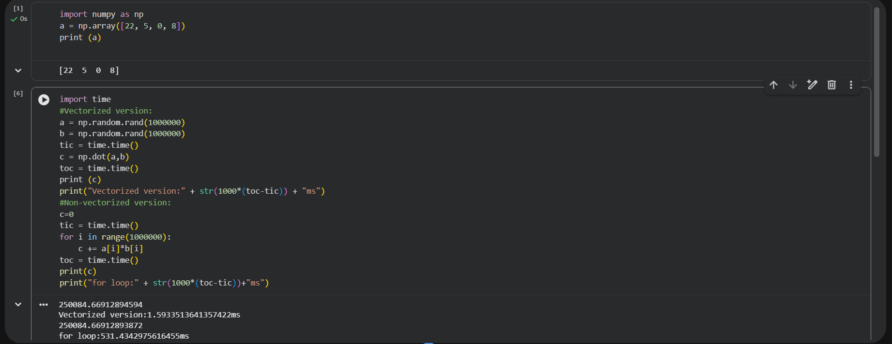


---

## Vectorizing Logistic Regression 

For vectorizing *m* training examples at the same time we perform the following steps:
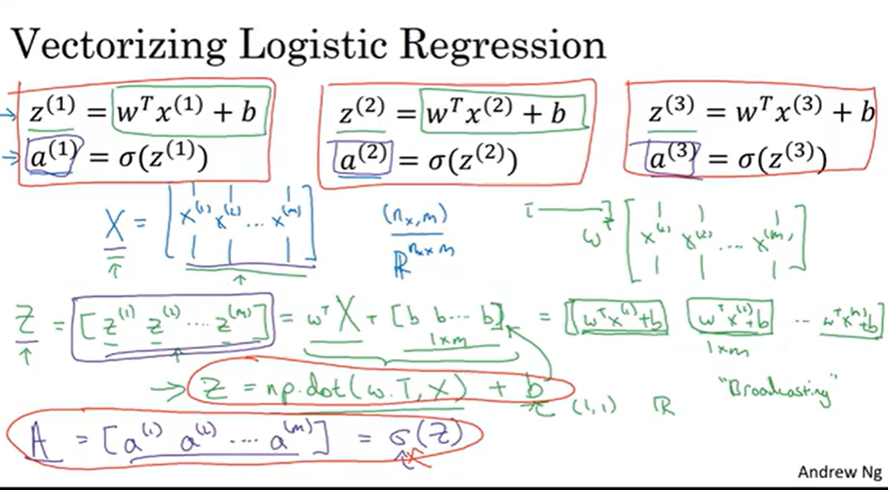

## Implementing Logistic regression
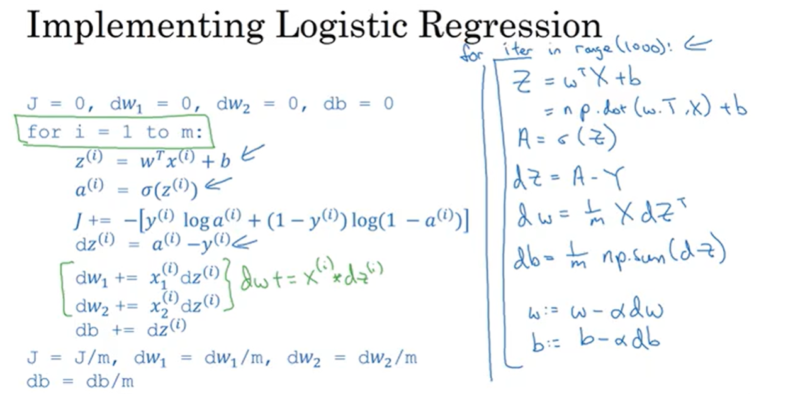


---

# Broadcasting

**Broadcasting** is a feature in NumPy that allows arithmetic operations between arrays of different shapes without explicitly resizing them.

Instead of creating duplicate copies of data, NumPy automatically expands the smaller array to match the dimensions of the larger array during computation.

---

# Example

Consider the following matrix representing the nutritional values of different foods.

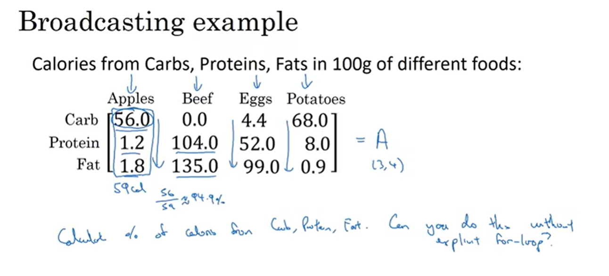

First, compute the sum of each column.

```python
cal = A.sum(axis=0)
```

The result is a vector containing the total of each column.

Next, compute the percentage contribution of each element.

```python
percentage = 100 * A / cal.reshape(1,4)
```

NumPy automatically broadcasts the vector `cal` across all rows of the matrix, allowing element-wise division without using explicit loops.

---

# Why reshape(1,4)?

The statement

```python
cal.reshape(1,4)
```

converts the vector into a **1 × 4 row vector**.

This makes its dimensions compatible with the matrix so that NumPy can broadcast it across every row.

---

NumPy compares array dimensions from **right to left**.

Broadcasting is possible when:

- The dimensions are equal, or
- One of the dimensions is **1**.

If neither condition is satisfied, broadcasting cannot be performed.

---


## Hands-On 
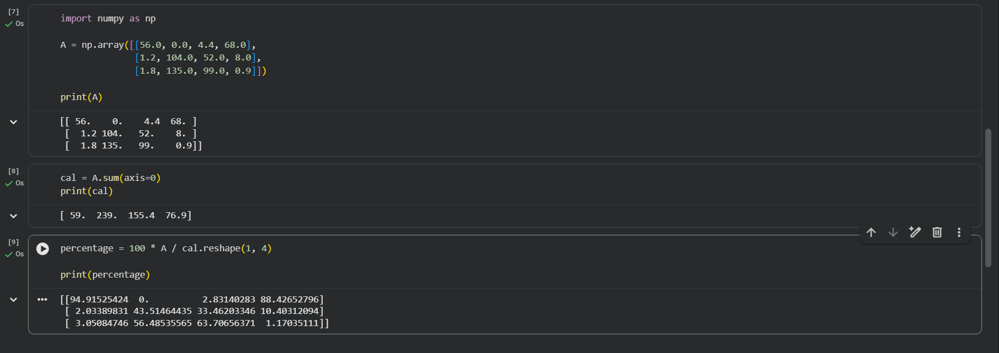

---
## General Principle:
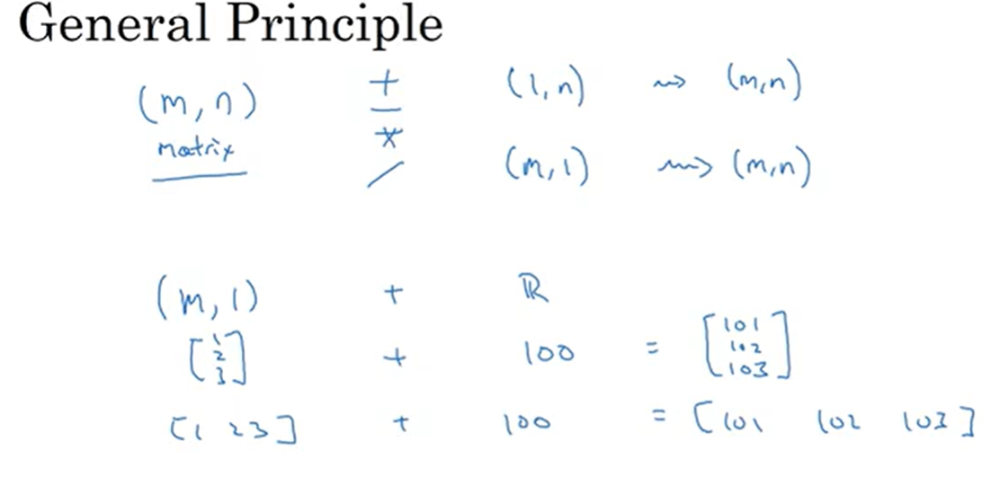

