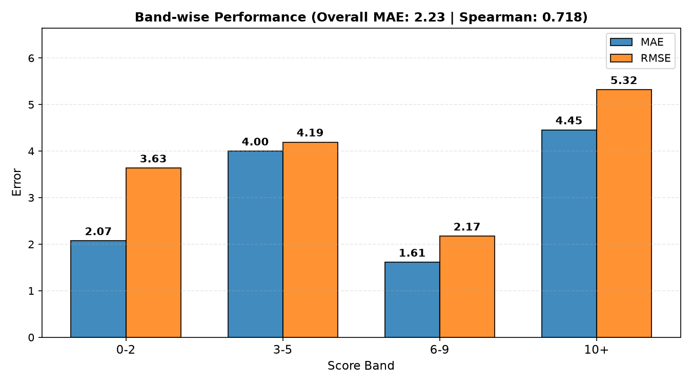
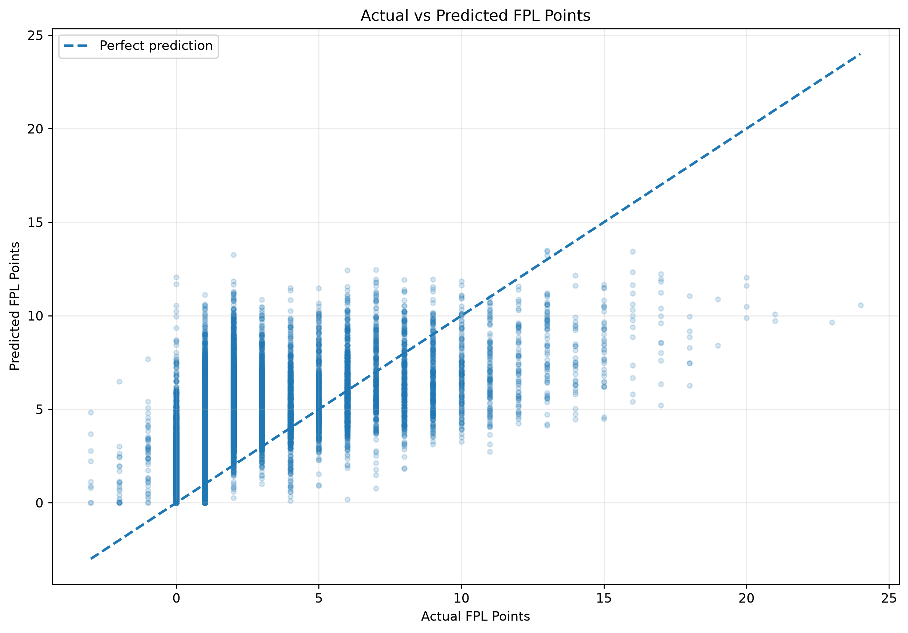
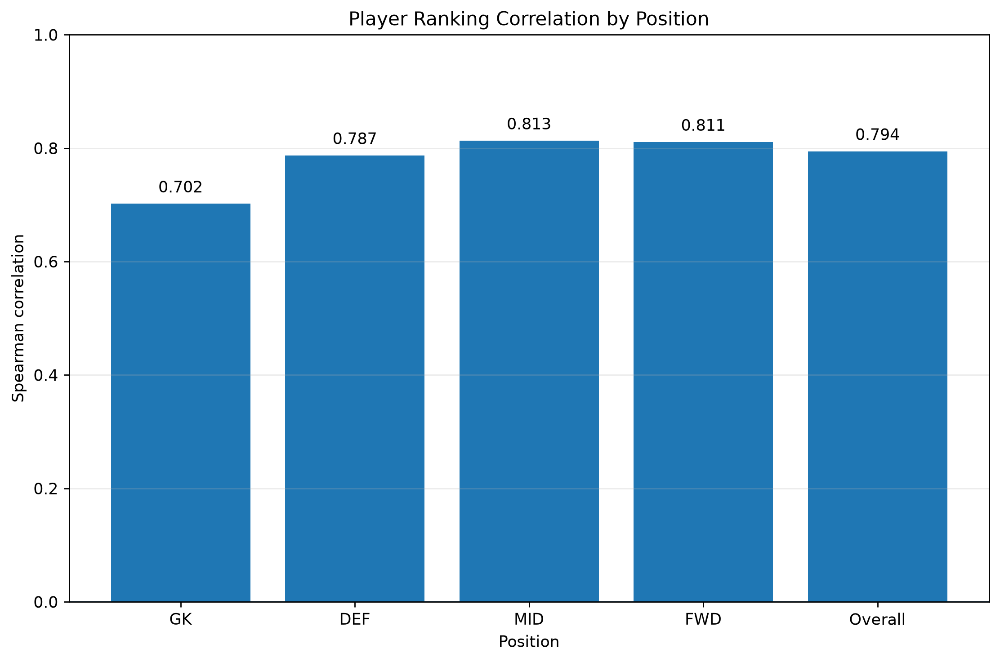
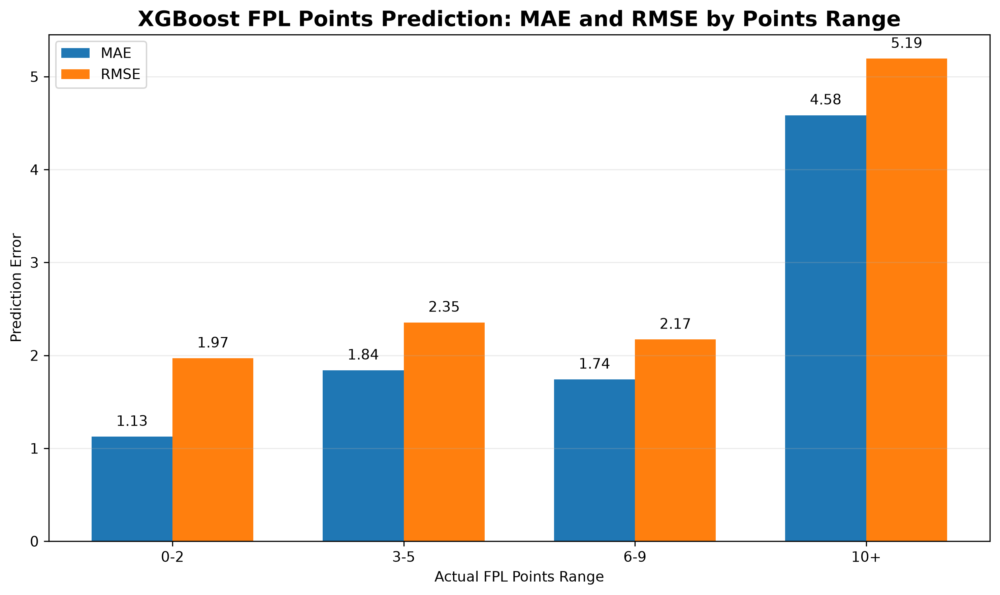

# FantasyXI

**An AI-powered decision-support system for Fantasy Premier League squad management**, built to predict player performance, reason strategically about transfers and chips, and turn that reasoning into a legal, optimal squad — one gameweek at a time.

*Project X, Community of Coders (COC) @ VJTI*

> **[TODO: Insert system architecture diagram here]**

---

## Overview

FantasyXI takes historical Premier League and FPL data and turns it into a full gameweek-by-gameweek squad recommendation: predicted player points, a strategic transfer/chip decision, a legally valid 15-player squad, a starting XI, and a captain — repeated sequentially across a season, with every gameweek building on the previous one's actual result.

It is not a single model. It's a pipeline of four distinct layers, each solving a different part of the problem:

1. **Prediction** — how many points is each player likely to score?
2. **Strategy (RL)** — how aggressive should this gameweek's transfers be, and is a chip worth playing?
3. **Optimization (MILP)** — given that strategy, what is the best *legal* squad?
4. **Sequential state** — carry the result (squad, bank, free transfers, chips used) into the next gameweek.

## Problem

Fantasy Premier League rewards players who can consistently pick a strong 15-man squad under a fixed budget, decide when to spend a transfer (or take a points hit for an extra one), and time season-long "chips" correctly — all while working from incomplete, noisy information about how players will actually perform. Doing this well, every week, for a full 38-gameweek season is a lot of repeated, interdependent decision-making. FantasyXI explores whether that process can be automated: predicting performance from data, and using a trained strategic policy plus a constraint solver to make legal, reasoned squad decisions gameweek after gameweek.

## Our Approach

FantasyXI splits the problem the way a real manager would: first figure out *who's going to play well* (prediction), then decide *how aggressively to act on that* (strategy), then work out *the best legal squad given that strategy* (optimization). Keeping these as separate, swappable layers means the prediction model can change (BiLSTM or XGBoost) without touching how transfers are decided, and the strategic layer (PPO) never has to know how to enforce FPL's squad rules — that's the optimizer's job.

## Key Features

- **Two swappable prediction models** — a BiLSTM dual-expert network (current default) and a position-specific XGBoost ensemble (fallback/alternative), both producing the same canonical prediction schema.
- **PPO-trained strategic decision layer** — learns how aggressive to be with transfers, how much of the budget to spend, whether to bias toward attack/defence, and when to play a chip.
- **MILP squad optimizer** — turns that strategy into a legal 15-player squad and starting XI, enforcing FPL's real constraints (budget, position counts, club limits, transfer hits).
- **Sequential season execution** — each gameweek's squad, bank, free transfers, and chip availability carry forward into the next, not independently recomputed from scratch.
- **All four FPL chips implemented** — Wildcard, Free Hit, Bench Boost, Triple Captain — each usable once per season, tracked in the RL observation and enforced end-to-end.
- **A working local demo** — a FastAPI backend and a plain HTML/CSS/JS frontend that visualize the real pipeline, gameweek by gameweek, in a browser.

## System Architecture

```
Historical FPL / player data
        ↓
Prediction layer (BiLSTM default, XGBoost fallback)
        ↓
Predicted player points
        ↓
RL decision layer (PPO) — strategic action
        ↓
MILP optimization — legal 15-player squad
        ↓
Starting XI + captain/vice (part of the same squad decision)
        ↓
Gameweek result / reward
        ↓
Sequential season state → feeds the next gameweek
```

> **[TODO: Insert a polished version of this pipeline as a diagram/image here]**

## Prediction Layer

The prediction layer estimates each player's expected FPL points for an upcoming gameweek from historical FPL, fixture, team, and Understat-derived data. Both models are built to **rank players well**, rather than reproduce exact scorelines — FPL decisions care much more about "who's likely to outscore whom" than an exact point value.

### BiLSTM (current default)

A dual-expert gate architecture: a 2-layer BiLSTM with temporal attention converts each player's 5-gameweek history into a trajectory representation, which is then routed to one of two specialist regressors (a low-band expert for baseline appearances, a high-band expert for scoring returns) plus a haul-potential calibrator for explosive, double-digit gameweeks.

| Metric (2025–26 test set) | Overall | 0–2 pts | 3–5 pts | 6–9 pts | 10+ pts |
|---|---|---|---|---|---|
| MAE | 2.2315 | 2.072 | 3.998 | 1.610 | 4.453 |
| RMSE | 3.6546 | 3.634 | 4.192 | 2.171 | 5.318 |
| Spearman | 0.7183 | — | — | — | — |

*(23,406 test samples. Source: `models/BiLSTM_model/reports/evaluation_summary.txt`.)*



### XGBoost (fallback / alternative)

Position-specific XGBoost regressors (separate models for GK/DEF/MID/FWD), trained on engineered features from Supabase-hosted historical FPL, fixture, team, and Understat data.

| Metric (2025–26 test set) | Overall | GK | DEF | MID | FWD |
|---|---|---|---|---|---|
| MAE | 1.2689 | — | — | — | — |
| RMSE | 2.1067 | — | — | — | — |
| Spearman (ranking) | 0.7947 | 0.7021 | 0.7881 | 0.8133 | 0.8115 |

*(Source: `models/xgboost_model/README.md`.)*





Both models write predictions to a shared canonical schema (`rl_decision_layer/predictions/interface.py`), which is what makes them interchangeable — the decision layer downstream never needs to know which one produced a given number.

## Decision & Optimization Layer

### PPO — the strategic layer

A PPO agent (Stable-Baselines3) doesn't pick players — it picks a small **strategic action** that shapes how the optimizer behaves that gameweek:

| Action component | What it controls |
|---|---|
| Aggressiveness | How willing the optimizer is to take a transfer hit for extra points (maps to the MILP's hit cost) |
| Budget level | What fraction of available funds (85% / 95% / 100%) gets spent this gameweek |
| Position bias | Whether the squad leans toward attack, defence, or stays neutral |
| Chip choice | None, Wildcard, Free Hit, Bench Boost, or Triple Captain — each usable once per season |

The agent observes a 71-dimensional state (each squad player's price/predicted points/form/fixture difficulty, bank, free transfers, gameweek, the best available replacement per position, and chip availability), and its action feeds directly into the MILP call below. The trained artifact, `rl_decision_layer/ppo/models/ppo_fpl_v4.zip`, is the one used everywhere in this repository — an older `ppo_fpl.zip` is kept only for historical reference and is not compatible with the current code.

### MILP — the optimization layer

A mixed-integer linear program (`select_squad`, via PuLP) turns PPO's strategic action into an actual legal squad, maximizing total predicted points subject to constraints taken directly from FPL's real rules:

- Exactly 15 players: 2 GK, 5 DEF, 5 MID, 3 FWD.
- Maximum 3 players from any one club.
- Total squad cost within budget (bank + current squad value, or the full £100m for a fresh squad).
- Free transfers roll over (capped at 5); anything beyond that costs 4 points per transfer ("a hit"), and the solver only takes a hit when the predicted points gained outweigh the cost.

A second MILP (`pick_starting_xi`) then selects 11 starters from the 15-man squad under FPL's formation rules (1 GK, 3–5 DEF, 2–5 MID, 1–3 FWD) and assigns captain/vice-captain as the highest and second-highest predicted scorers among starters — this is a downstream part of the same squad decision, not a separate architectural pillar.

Scoring (`score_outcome`, `calculate_reward`) applies real FPL mechanics on the result: captain points are doubled, a starter with 0 minutes is auto-substituted from the bench, and the reward is net of any transfer-hit penalty.

### FPL Terminology

| Term | Meaning in FantasyXI |
|---|---|
| GW | Gameweek — one round of Premier League fixtures |
| FT | Free Transfer — a transfer that doesn't cost points |
| Hit | A transfer beyond available free transfers, costing 4 points |
| Bank | Remaining budget after the current squad's value is accounted for |
| Chip | A one-per-season special action: Wildcard, Free Hit, Bench Boost, Triple Captain |
| Predicted Points | The prediction layer's estimated points for a player in a gameweek |
| PPO | The reinforcement-learning strategic decision layer |
| MILP | The mixed-integer optimizer that enforces squad legality |
| Starting XI | The 11 of 15 squad players who actually score points that gameweek |

### Sequential gameweek execution

FantasyXI does not optimize each gameweek independently. Every gameweek's decision starts from the *actual outcome* of the previous one:

```
GW1 squad, bank, free transfers, chips
        ↓  (PPO strategy + MILP transfers)
GW2 squad, bank, free transfers, chips
        ↓
GW3 …
```

`SeasonState` (`rl_decision_layer/ppo/season_controller.py`) is what carries this forward — squad IDs, bank, free-transfer count, and which chips have already been used. This is what makes the system's behavior genuinely sequential rather than five independent "best squad" runs: a player bought in one gameweek can be sold again the next, free transfers accumulate when unused (capped at 5), and a chip used once is unavailable for the rest of the season. The same mechanism is what lets the local demo (below) resume a season one click at a time.

## Project Journey / Mini Projects

Before the full pipeline, two smaller projects were used to build up the RL/PPO skills the main system relies on:

- **`mini_projects/rl_sandbox/`** — a DQN agent trained on a small, synthetic 10-gameweek FPL-like environment, used to learn the mechanics of an RL agent interacting with a budget/transfer environment before working with real data.
- **`mini_projects/PPO mini project/`** — PPO applied to a portfolio-management environment (not FPL), used to learn PPO/Stable-Baselines3 itself before applying it to the FPL decision layer.

Both are exploratory and separate from the production pipeline — each has its own `requirements.txt` and isn't part of the root install.

## Results / Evaluation

### Prediction layer

See the BiLSTM and XGBoost tables above — both are evaluated on the real 2025–26 test season and are ranking-oriented (Spearman correlation), since FPL decisions care about relative player ordering more than exact point values.

### PPO decision layer — 38-gameweek run

Running the trained `ppo_fpl_v4.zip` sequentially across the full 2025–26 season (`rl_decision_layer/ppo/evaluate_full_report.py`, raw data in `rl_decision_layer/ppo/ppo_38gw_evaluation_results.csv` and `reports/ppo_38gw_detailed_breakdown.csv`):

| Metric | Value |
|---|---|
| Season net points (38 GW) | 2,208.0 |
| Average points / GW | 58.11 |
| Transfer hits taken | 0 |
| Chips deployed | Free Hit (GW1, 65.0 pts) · Wildcard (GW2, 101.0 pts) · Triple Captain (GW3, 129.0 pts) · Bench Boost (GW4, 99.0 pts) |
| Season completion | GW1 → GW38, no infeasible gameweeks |

Captain choice rotated across the season (Haaland, Salah, Saka, Watkins, and others at different points) rather than staying fixed to one player throughout.

> **[TODO: Insert RL training/results graph here]** — a season-progression chart (cumulative points per gameweek) would visualize the table above; not yet generated as an image.

### How do we know a recommended team is actually good?

This is the evaluation question our mentors raised directly: if FantasyXI hands you a squad for a gameweek, what's the basis for trusting it, and what can it be compared against?

Honestly, as of this README: the **prediction layer** is evaluated against real historical outcomes (MAE/RMSE/Spearman, above) — that part has a clear, measurable answer. The **decision layer**'s 38-gameweek run above is real and reproducible from the checked-in PPO model and historical data, but it is a single run, not yet compared against a validated baseline. A deterministic, PPO-free baseline *is* implemented (`rl_decision_layer/run_baseline.py` / `historical_loop.py` — the MILP picks the best squad each gameweek with no strategic layer on top), which is the natural comparison point for "did the RL strategy actually help." An earlier internal report (`rl_decision_layer/ppo/reports/FULL_SEASON_EVALUATION_REPORT.md`) claims a specific baseline score, but on inspection that number is a hardcoded constant in the report script, not the output of an actual baseline run captured anywhere in this repository — so it should not be treated as verified evidence.

> **[TODO: Run `run_baseline.py`/`historical_loop.py` for the same 2025–26 season and record its real net-points total here, as a genuine, apples-to-apples comparison against the 2,208.0 PPO result above.]**

## Frontend / Demo

A local, single-process demo visualizes the pipeline above as a clickable sequential season:

```
Start Season → Gameweek 1 → Next Gameweek → Gameweek 2 → Next Gameweek → … → Season Complete
```

Each screen — squad, starting XI (shown as a pitch formation built from the real position counts that gameweek), captain/vice, transfers, chips, bank/free transfers — is rendered directly from what the backend returns; **the frontend contains no prediction, RL, or optimization logic of its own**, it's a view onto the same `PPOEnv`/`SeasonState` machinery used by the CLI tools.

> **[TODO: Insert final FantasyXI demo screenshot here]**

See [Installation / Setup](#installation--setup) below for how to run it.

## Project Structure

```text
FantasyXI/
├── models/
│   ├── BiLSTM_model/          # Dual-expert BiLSTM prediction model (current default)
│   └── xgboost_model/         # Position-specific XGBoost prediction model (fallback)
├── rl_decision_layer/
│   ├── predictions/           # Canonical prediction schema (joins BiLSTM/XGBoost output)
│   ├── candidates/            # Per-position candidate shortlisting
│   ├── environment/           # Squad rules + historical gameweek stepping
│   ├── optimization/          # MILP squad selection, starting XI, scoring, chips
│   ├── ppo/                   # PPO observation/action/env, training, trained models
│   └── tests/                 # Test suite for the decision layer
├── backend/                   # FastAPI backend wrapping the sequential pipeline
├── frontend/                  # Plain HTML/CSS/JS demo UI (no build step)
├── mini_projects/             # Exploratory RL projects that preceded the main pipeline
├── requirements.txt           # Consolidated dependencies for the whole project
└── README.md
```

## Future Scope

- **Live FPL data integration** — the system currently runs entirely on historical, already-collected data; there is no live price/fixture/gameweek fetching yet.
- **A more adaptive decision layer** — PPO's strategic action has not yet been shown to vary its aggressiveness/budget/position-bias choices situationally; further training and evaluation is needed to demonstrate genuine adaptiveness rather than fixed behavior.
- **Forward-looking optimization** — the MILP is myopic (optimizes one gameweek at a time and always spends its full budget), which can cause late-season infeasibility; a budget-aware, multi-gameweek-lookahead MILP is a natural next step.
- **A validated baseline comparison** — see the Results/Evaluation section above.

## Installation / Setup

### Prerequisites

- Python 3.10+ (developed and tested on 3.12).
- No Node.js/npm/React — the frontend is plain HTML/CSS/JS served directly by the backend.

### Install dependencies

The whole project (both prediction models + the RL/MILP decision layer + backend) from one file:
```bash
pip install -r requirements.txt
```
If you only want to run the existing demo (no retraining), a lighter, scoped install is enough — everything the demo needs is already generated and committed:
```bash
pip install -r rl_decision_layer/requirements.txt -r backend/requirements.txt
```
Each component also keeps its own minimal `requirements.txt` (`models/BiLSTM_model/`, `models/xgboost_model/`, `rl_decision_layer/`, `backend/`) if you only need one part of the project.

## Usage / Quick Start

### Run the full local demo (recommended — uses the existing trained artifacts)

```bash
uvicorn backend.app:app --reload --port 8000
```
Open **http://localhost:8000**, click **Start Season**, then **Next Gameweek** to step through the real 2025–26 season one gameweek at a time, up to Gameweek 38.

### Run the sequential pipeline from the command line

```bash
python -m rl_decision_layer.ppo.season_controller --start-gameweek 1 --num-gameweeks 5
```
Runs 5 consecutive gameweeks, carrying squad/bank/free-transfers/chips forward each step, and prints the full decision each gameweek.

```bash
python -m rl_decision_layer.ppo.show_squad --start-gameweek 1
```
Prints one gameweek's recommendation in isolation (not sequential).

```bash
python -m rl_decision_layer.run_baseline
```
Runs the deterministic, PPO-free MILP-only baseline.

## Training / Retraining Options

The trained artifacts already in this repository (`ppo_fpl_v4.zip`, BiLSTM checkpoints, XGBoost models) are sufficient to run everything above — none of this is required for the demo.

**Retrain BiLSTM:**
```bash
python models/BiLSTM_model/gate_architecture/train.py
python models/BiLSTM_model/gate_architecture/predict.py
```

**Retrain XGBoost:**
```bash
python models/xgboost_model/scripts/train.py
```

**Retrain PPO:**
```bash
python -m rl_decision_layer.ppo.train --timesteps 50000
```
⚠️ This always overwrites whatever file is at its save path (default `ppo_fpl_pure_rl.zip`, deliberately **not** `ppo_fpl_v4`). Never pass `--save-name ppo_fpl_v4` — that name is reserved for the frozen, evaluated model this README's results describe, and a freshly retrained model will not reproduce the same behavior even with identical hyperparameters.

More detail on every command, test suite, and component-level design decision is in `rl_decision_layer/README.md` and `models/xgboost_model/README.md`.

## Contributors

- **Darshan Mahale**
- **Bhoomi Vaity**

## Mentors / Acknowledgements

- **Ojas Alai**
- **Kavish Nasta**

Built under **Project X, Community of Coders (COC) @ VJTI**.
